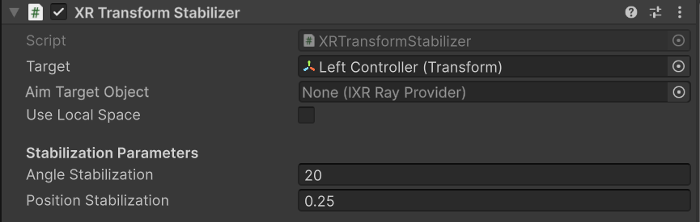

# XR Transform Stabilizer

Reduce unwanted jitter from tracked controllers and hands with low-latency stabilization. This is especially useful for smoothing the movement of ray interactors.

 *The XR Transform Stabilizer showing all properties.*

## XR Transform Stabilizer properties

The XR Transform Stabilizer contains the following properties:

| **Property** | **Description** |
|:---|:---|
| **Target** | Sets the Transform to track and stabilize, such as a controller GameObject. |
| **Aim Target Object** | Sets an optional ray interactor (specifically an [`IXRRayProvider`](xref:UnityEngine.XR.Interaction.Toolkit.Interactors.IXRRayProvider)) to assist with aiming.   The component uses this reference to calculate the rotation that best stabilizes the ray's endpoint. It optimizes between using the previous rotation (to minimize angular changes) and the target-locked rotation (to minimize positional changes). |
| **Use Local Space** | Reads the target's pose and applies stabilization in local space. If disabled, uses world space. Use local space for targets on moving objects, such as platforms or vehicles. Local space prevents jitter by stabilizing the target relative to its moving parent instead of the world. |

### Stabilization parameters

The **Stabilization Parameters** section contains the following properties:

|**Property**  | **Description** |
|:---|:---|
| **Angle Stabilization** | Sets the threshold (in degrees) for smoothing. If the target's rotation changes by less than this value in one frame, the component smooths the movement. If the change is greater, the component stops smoothing and directly follows the target's new rotation.|
| **Position Stabilization** | Sets the threshold (in meters) for smoothing. If the target's position changes by less than this value in one frame, the component smooths the movement. If the change is greater, the component stops smoothing and directly follows the target's new position.|

## Additional resources

* [Near-Far Interactor](near-far-interactor.md)
* [XR Ray Interactor](xr-ray-interactor.md)
* [`XRTransformStabilizer` class](xref:UnityEngine.XR.Interaction.Toolkit.Inputs.XRTransformStabilizer)
* [Component index](xref:xri-components)
