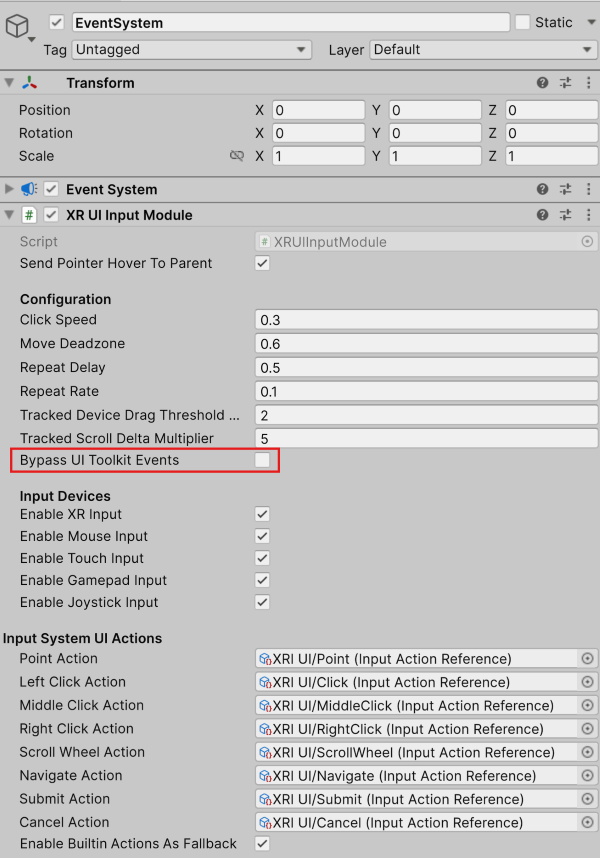

# XR UI Input Module

The **XR UI Input Module** is the component that the XR Interaction Toolkit requires to properly interface with the Event System.

An **XR UI Input Module** works in concert with the [Near-Far Interactor](near-far-interactor.md), [XR Ray Interactor](xr-ray-interactor.md), and [XR Poke Interactor](xr-poke-interactor.md) to ensure the XR Interaction Toolkit interactions with the UI are processed correctly. It also handles input from other non-XR sources (such as gamepad or mouse) if configured to do so. In the component configuration pictured below, the **Input System UI Actions** and **Input Manager** options are displayed. Depending on the **Active Input Handling** setting in **Edit &gt; Project Settings &gt; Player**, one or both of these configuration options may be visible. If you are using the Input System package for handling input you have a few options for setup. We recommend using the `XRI Default Input Actions.inputactions` and `XRI Default XR UI Input Module.preset` file provided with the [Starter Assets](samples-starter-assets.md) sample, which allows for the greatest control and flexibility. Alternatively, you can create an Input Action asset with associated Action Map and Actions and manually assign the **Input System UI Actions** for each of the fields. Finally, you can leave all the **Input System UI Actions** unset (`None`) and turn on the **Enable Builtin Actions As Fallback** checkbox, which will let the default mouse, gamepad, or joystick actions drive the UI with the current Input System devices configured.

> [!NOTE]
> If you have **Active Input Handling** set to **Both**, you will need to make sure to set the **Active Input Mode** on the **XR UI Input Module** to your desired source of input. Keep in mind that there may be minor performance impacts by setting this option to Both.

> [!IMPORTANT]
> If you have an existing Canvas or Event System, you will likely have a **Standalone Input Module** or **Input System UI Input Module** component which will prevent proper input processing. Remove it by clicking the **More menu (&#8942;)** and selecting **Remove Component**. Other UI Input Modules are not compatible with the **XR UI Input Module** and may cause undesired or unexpected behavior. Therefore, only use a single Input Module to handle UI interactions.

## UI Toolkit support

If you wish to enable support for UI Toolkit panels, please see documentation for [World-Space UI Toolkit Support](xref:xri-ui-world-space-ui-toolkit-support).

> [!NOTE]
> The `XRUIInputModule` does not support [UI Toolkit](https://docs.unity3d.com/Manual/UIElements.html) and should only be used with uGUI or when combining UI Toolkit and uGUI in the same scene. While combining UI systems is allowed, we recommend choosing UI Toolkit or uGUI, as using them together may lead to unexpected behavior.

If not using XRI's World-Space support when using UI Toolkit, be aware that it will instantiate an event listener in the form of the `PanelEventHandler` component which intercepts events from the `XRUIInputModule`. However, the `XRUIInputModule` currently does not support sending UI Toolkit events from the Event System on behalf of the `XRUIInputModule`. A `PanelInputConfiguration` component can be added to the scene and the **Panel Input Redirection** field set to **No input redirection**. This is the recommended method from UI Toolkit. Alternatively, [`EventSystem.SetUITookitEventSystemOverride`](https://docs.unity3d.com/Packages/com.unity.ugui@1.0/api/UnityEngine.EventSystems.EventSystem.html#UnityEngine_EventSystems_EventSystem_SetUITookitEventSystemOverride_UnityEngine_EventSystems_EventSystem_System_Boolean_System_Boolean_) can be called to bypass this default mechanism when it becomes the current/activated Input Module by the `EventSystem`. This is set up in a convenient option in the UI called **Bypass UI Toolkit Events**.

