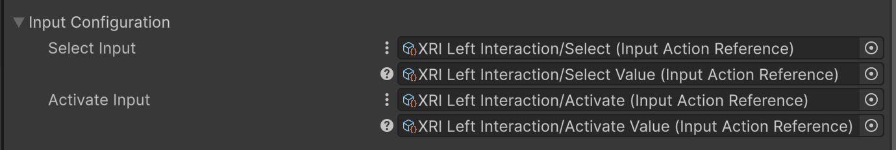
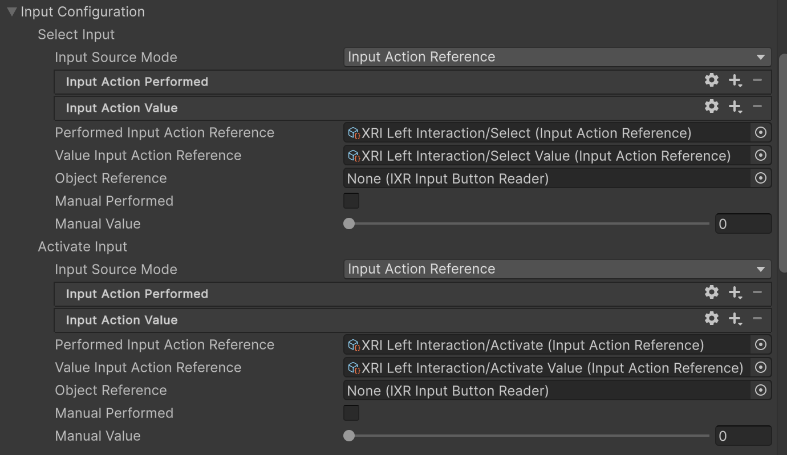

# Project settings and validation

You can find both the project settings and validation checks specific to the XR Interaction Toolkit in the **XR Plug-in Management** area of your **Project Settings**.

To find these settings in the Unity Editor:

1. Open **Project Settings** (menu: **Edit &gt; Project Settings**).
2. Expand the **XR Plug-in Management** area.

   > [!NOTE]
   > If the **XR Plug-in Management** settings page states that it needs to be installed, you must do so before you can access the toolkit settings.

3. Select **XR Interaction Toolkit** for settings.
4. Select **Project Validation** to view the validation checks. The XR Interaction Toolkit validation checks are listed among the checks for other XR packages. Refer to [Project Validation](xref:xr-core-utils-project-validation) for general information about XR project validation.

## Settings

The XR Interaction Toolkit provides a few settings that modify Editor and runtime behavior.

### XR Device Simulator Settings

These settings control the [XR Simulator](xref:xri-xr-device-simulator-overview), which you can install from the Package Manager window.

* **Use XR Device Simulator in scenes**

   The XR device simulator prefab is instantiated automatically by Unity when you enter Play mode.

* **Instantiate in Editor Only**

   When enabled, the simulator prefab is only added in the Editor. Disable to add the prefab to Standalone (desktop) builds, too. (The simulator prefab is never added to XR platform builds automatically.)

* **XR Device Simulator prefab**

   The simulator prefab. You can change this reference if you have a customized prefab you would rather use.

### Editor Settings

The **Input Reader Property Drawer Mode** setting modifies how some input-related Inspector properties are shown in the Editor. You have the following options:

* **Compact**: the most condensed option. **Input Source Mode** options are available through a &vellip; menu icon. Only settings for the selected source mode are shown.

   

* **Multiline Effective**: provides the same setting display as **Condensed**, but the **Input Source Mode** has its own line in the Inspector.

   

* **Multiline All**: shows all options, even those that don't apply to the current **Input Source Mode**.

   

### Interaction Layer Settings

[Interaction Layers](xref:xri-interaction-layers) let you create masks to determine which interactors can interact with which interactables. You must assign a name to a layer before you can use it in a mask.

By convention, layer 31 should be named, "Teleport", when you use teleportation as a form of locomotion.

## Project validation

The **Project Validation** page shows the status of specific checks that the XR Interaction Toolkit and other XR packages run to help you avoid configuration problems in your project. (By default, passing  checks are not shown, only those with recommended or required fixes.)

When a straightforward fix is available, you can correct a validation issue by clicking the **Fix** or **Fix All** buttons. This makes the changes necessary to resolve the issue in your project configuration, which could be a settings change or installing another package or package sample. In other cases, you can click the **Edit** button to make the project configuration changes yourself.

The validation checks for the toolkit include:

* Starter Assets: _Shader Graph must be installed for materials in this sample._

   Some of the materials in the [Starter Assets](xref:xri-samples-starter-assets) use Shader Graph shaders. To fix this problem, you can install the Shader Graph package or change the materials to use a different type of shader.

   > [!IMPORTANT]
   > Shader Graph does not support [single-pass instanced rendering](xref:SinglePassStereoRendering) on the Built-In Render Pipeline. If your project uses the Built-In Render Pipeline, you can do one of the following:
   >
   > * Change the **Render Mode** to **Multi-pass** in the settings for each XR Provider Plug-in in the project. Typically, single-pass instanced rendering provides better performance.
   > * Replace the shaders of any Materials that use a Shader Graph shader with a different shader type.
   > * Update the render pipeline to the Universal Render Pipeline (URP).

* Starter Assets: _Interaction Layer 31 should be set to 'Teleport' for teleportation locomotion._

   By convention, the teleportation assets use layer 31 and expect it to be named, "Teleport". To fix this issue, you can assign the name in the [XR Interaction Toolkit settings](#interaction-layers). You can also ignore the warning if you don't implement teleportation or you want to use a different layer. If you use a different layer, you might have to adjust the **Interaction Layer Mask** property of any **Interactors** used to trigger teleportation.

* AR Starter Assets: _Starter Assets sample from XR Interaction Toolkit package must be imported or update to use this sample._

   The AR-specific assets depend on the general-purpose Starter Assets. To fix this warning, [import the Starter Assets sample](xref:xri-installation#installing-samples).

* AR Starter Assets: _AR Foundation package must be installed to use this sample._

   The AR assets use features provided by [AR Foundation](xref:arfoundation-manual) and do not work unless you add that package to the project. To fix this issue, follow the AR Foundation [installation instructions](xref:arfoundation-install).

Refer to [Project Validation](xref:xr-core-utils-project-validation) for general information about the **Project Validation** section.
